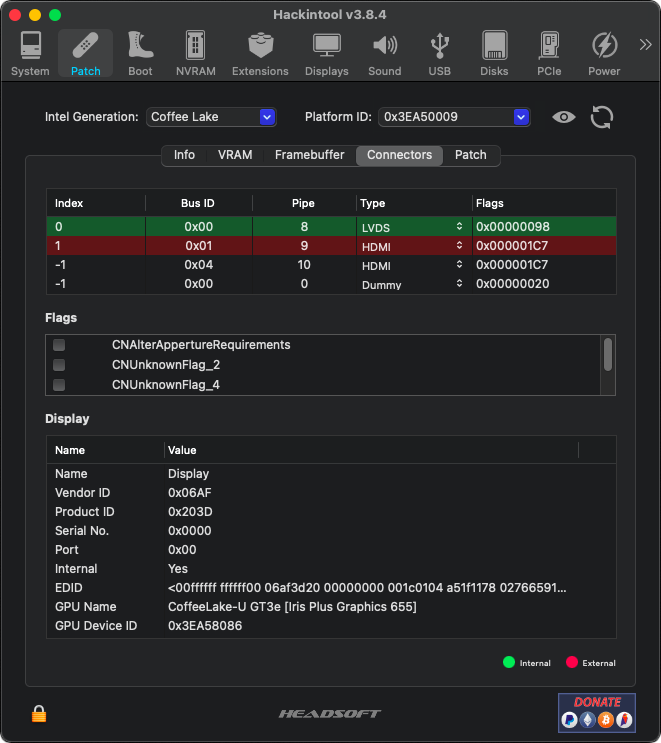

# Actively Used Configuration

Currently running **MacOS 10.13 Ventura** since OpenCore **0.9.5**.

## Current BIOS Revision

ASCN51WW [(Release Notes)](../BIOS/ASCN51WW.txt)

## Generating Personalised SMBIOS

It is important to generate a personalised SMBIOS using `MacBookPro15,2` as target model. To complete the respective OpenCore configuration section for SMBIOS (namely `MLB`, `SystemSerialNumber` and `SystemUUID` keys) it is advised to use [GenSMBIOS](https://github.com/corpnewt/GenSMBIOS) scripts and add the generated values in the respective places in `config.plist` file.

As for the _unique_ number needed in the **ROM** value of the `PlatformInfo` section, the recommended method is to take the 12 digits from the **en0** network controler (without the colons) and convert them to [Base64](https://cryptii.com/pipes/hex-to-base64) for use as `<data>` under `<key>ROM</key>` in the OpenCore configuration file. The value `<data>ESIzRFVm</data>` is generic; read more over at [Dortania](https://dortania.github.io/OpenCore-Post-Install/universal/iservices.html#fixing-rom).

To confirm that the injected value works persistently across reboots, one can either run in Terminal [iMessageDebug](https://mac.softpedia.com/get/System-Utilities/iMessageDebug.shtml) or the command:<br/>
`nvram -x 4D1EDE05-38C7-4A6A-9CC6-4BCCA8B38C14:ROM` and verify the output.

## OpenCore Configuration Notes

These files have been running without issues since the official OpenCore **v0.7.1** release on [GitHub](https://github.com/acidanthera/OpenCorePkg/releases).

The original configuration, especially setting the "Quirks" to the correct values for this _specific_ laptop chipset and platform, was done by following the Dortania [Coffee Lake and Whiskey Lake Guide](https://dortania.github.io/OpenCore-Install-Guide/config-laptop.plist/coffee-lake.html) for laptops and has remained pretty much the same with the last OpenCore iterations.

## OpenCore Configuration Files

* **config.normal.plist** → Boots to default drive as a normal Mac would do (non-verbose) without any boot options displayed; only a small time-window is set to allow options via keyboard; all kexts are enabled, debug logging is disabled. Keys `ShowPicker` set to false, `Timeout` set to 0 seconds and `TakeoffDelay` set 5000 microseconds.

* **config.picker.plist** → Shows boot options (i.e. picker) with basic tools; all hidden Auxiliary tools are displayed if 'Space' is pressed on keyboard; after a brief time-out, continues (non-verbose) booting to default drive; all kexts are enabled, debug logging is disabled. Keys `ShowPicker` set to true, `Timeout` set to 5 seconds and `TakeoffDelay` set 0 microseconds.

* **config.emergency.plist** → Shows boot options (i.e. picker) with **all** Auxiliary tools displayed; after a brief time-out, continues **verbose** `-v` booting to default drive; Wi-Fi and BTLE kexts are disabled; debug logging is enabled, including boot arguments being present. Keys `HideAuxiliary` set to false, `ShowPicker` set to true, `Timeout` set to 5 seconds. Additionally, `SecureBootModel` is disabled, `PanicNoKextDump`, `AppleDebug`, `ApplePanic`, `AllowNvramReset`, `AllowSetDefault` and `AllowToggleSip` are now enabled. Special boot arguments `keepsyms=1`, `debug=0x100`, `npci=0x2000` and `msgbuf=1048576` are set. **This file is notably used for USB installers.**

A **chime** configuration variant has been recently added, which plays the typical Apple boot sound upon each start or restart. The respective configurations only switch on the boot-time audio device by setting
`AudioSupport` to `true` and enabling the respective `AudioDxe.efi` firmware driver. Comparing the config files side-by-side will reveal these two distinct changes.

All configuration files have been **validated** with `ocvalidate` tool that has been included in the OpenCore releases since version 0.7.1.

<details>
<summary>So, what do these boot arguments <code>debug</code>, <code>keepsyms</code> and <code>npci</code> represent? :pushpin:</summary>

<br/>Firstly, `debug=0xH` (where H is hexadecimal number up to 4 digits) lets you set kernel debugging flags from this list:

* `DB_HALT                 0x01` - Halt at boot-time and wait for debugger attach (gdb)
* `DB_PRT                  0x02` - Send kernel debugging `printf` output to console
* `DB_NMI                  0x04` - Drop into debugger on a non-maskable interrupt i.e. NMI (Command–Power, Command-Option-Control-Shift-Escape or interrupt switch)
* `DB_KPRT                 0x08` - Send kernel debugging `kprintf` output to serial port
* `DB_KDB                  0x10` - Make ddb (kdb) the default debugger (requires a custom kernel)
* `DB_SLOG                 0x20` - Output certain diagnostic information to the system log
* `DB_ARP                  0x40` - Allow debugger to ARP and route (allows debugging across routers and removes the need for a permanent ARP entry, but is a potential security hole) not available in all kernels
* `DB_KDP_BP_DIS           0x80` - Support old versions of gdb on newer systems
* `DB_LOG_PI_SCRN         0x100` - Disable graphical panic dialog
* `DB_KERN_DUMP_ON_PANIC 0x0400` - Causes the kernel to core dump when the system panics
* `DB_KERN_DUMP_ON_NMI   0x0800` - Causes the kernel to core dump when the user triggers an NMI
* `DB_DBG_POST_CORE      0x1000` - Controls the kernel's behavior after dumping core in response to an NMI (DB_KERN_DUMP_ON_NMI); if the user triggers an NMI and this flag is clear, the kernel will dump core and then continue (conversely, if this flag is set the kernel will dump core and then wait for a debugger connection)
* `DB_PANICLOG_DUMP      0x2000` - Controls whether the kernel dumps a full core (if the flag is clear) or simply a panic log (if the flag is set)

Next, `keepsyms=1` does _not_ unload KLD/Address-Symbol translation i.e. it tells the OS to also _print_ the symbols when a kernel panic occurs. As a companion setting to `debug=0x100` this can give more helpful insights as to what is causing the panic(s). Read more [here](https://newbedev.com/is-there-a-list-of-available-boot-args-for-darwin-os-x).

Finally, to avoid verbose-mode boot freezes at `[PCI Configuration Begin]` due to some conflicting BIOS setting, it is advised to use `npci=0x2000` or `npci=0x3000` depending on the hardware generation. Per [Dortania](https://dortania.github.io/OpenCore-Install-Guide/troubleshooting/extended/kernel-issues.html#stuck-on-rtc-pci-configuration-begins-previous-shutdown-hpet-hid-legacy), most OEMs have very broken PCI allocation on older firmwares (especially AMD). If there is no BIOS option **Above4G** available to enable, the use of this boot argument is strongly advised.
</details>

## Notable Differences in Configurations

<details>
<summary>So, what are the exact configuration parameters that differentiate these OpenCore files above? :pushpin:</summary>

<br/>According to the [OpenCore documentation available](https://github.com/acidanthera/OpenCorePkg/blob/master/Docs/Configuration.pdf) the parameters below, when set or enabled, provide the following added functionality:

**Kernel → Quirks → PanicNoKextDump**

When enabled, macOS kernel is prevented from printing kext dumps in the panic log, thus helping observe the panic details themselves (only applicable to macOS 10.13 and newer).

**Misc → Boot → TakeoffDelay**

Delay (in microseconds) executed _before_ handling the OpenCore picker startup and action hotkeys. Introducing a delay may give extra time to hold the right action hotkey sequence to, for instance, boot into recovery mode. On some platforms, setting this option to a minimum of 5000-10000 microseconds may be required to access action hotkeys due to the nature of the keyboard driver.

**Misc → Boot → Timeout**

Timeout (in seconds) in the OpenCore picker _before_ automatic booting of the default boot entry starts; set to 0 to disable.

**Misc → Debug → AppleDebug**

Enables writing the `boot.efi` debug log to the OpenCore log (only applicable to macOS 10.15.4 and newer).

**Misc → Debug → ApplePanic**

Saves macOS kernel panic output to the OpenCore root (EFI) partition. The file is saved as `panic-YYYY-MM-DD-HHMMSS.txt` and it is strongly recommended to include the `keepsyms=1` boot argument that allows printing debug symbols in the panic log.

**Misc → Debug → DisplayLevel**

The following debug output levels are supported, provided that `Target` enables console (on-screen) printing:

* `0x00000002 - DEBUG_WARN in DEBUG, NOOPT, RELEASE`
* `0x00000040 - DEBUG_INFO in DEBUG, NOOPT`
* `0x00400000 - DEBUG_VERBOSE` in custom builds
* `0x80000000 - DEBUG_ERROR in DEBUG, NOOPT, RELEASE`

The most common value found in many configurations is integer `2147483648` that translates to `0x80000000` as well as `2147483650` that translates to `0x80000002`.

**Misc → Debug → Target**

The following logging targets are supported, besides `0x00` that is the failsafe value:

* `0x01` Enable logging, otherwise all log is discarded
* `0x02` Enable basic console (on-screen) logging
* `0x04` Enable logging to Data Hub
* `0x08` Enable serial port logging
* `0x10` Enable UEFI variable logging
* `0x20` Enable non-volatile UEFI variable logging
* `0x40` Enable logging to file

**Misc → Security → AllowNvramReset**

This option allows `CMD+OPT+P+R` keyboard shortcut during boot, while _also_ activating the display of the "NVRAM Reset" entry in OpenCore picker.

**Misc → Security → AllowSetDefault**

Allows using `CTRL+Enter` and `CTRL+Index` keyboard shortcuts that can change the default boot option (drive) in the OpenCore picker.

**Misc → Security → AllowToggleSip**

Enables in OpenCore picker the entry for disabling and enabling System Integrity Protection (SIP). **Note:** It is strongly recommended to _not_ make a habit of booting macOS with SIP disabled. The existence of this boot option is to just make it _easier_ to quickly disable SIP protection when genuinely needed, but it should be re-enabled again afterwards.

**Misc → Security → ScanPolicy**

The assigned value allows or prevents OpenCore from scanning and booting from untrusted sources (and partitions). A typical value of `17760515` (integer) or `0x10F0103` (hexadecimal) allows booting from most expected modern sources, whereas a value of `0` (zero) _disables_ this feature and allows booting from **any** source, especially useful for **USB installers.**

* `0x00000001 - OC_SCAN_FILE_SYSTEM_LOCK` restricts scanning to **file systems** defined as a part of this policy
* `0x00000002 - OC_SCAN_DEVICE_LOCK` restricts scanning to **device types** defined as a part of this policy
* `0x00000100 - OC_SCAN_ALLOW_FS_APFS` allows scanning of APFS file system
* `0x00010000 - OC_SCAN_ALLOW_DEVICE_SATA` allow scanning SATA devices
* `0x00020000 - OC_SCAN_ALLOW_DEVICE_SASEX` allow scanning SAS and Mac NVMe devices
* `0x00040000 - OC_SCAN_ALLOW_DEVICE_SCSI` allow scanning SCSI devices
* `0x00080000 - OC_SCAN_ALLOW_DEVICE_NVME` allow scanning NVMe devices
* `0x01000000 - OC_SCAN_ALLOW_DEVICE_PCI` allow scanning devices directly connected to PCI bus

**Misc → Security → SecureBootModel**

Sets "Apple Secure Boot" hardware model and policy. Specifying this value defines which operating systems will be bootable. Operating systems shipped before the specified model was released, will not boot. A value `Default` will match the model from the SMBIOS defined in the configuration; a value `Disabled` will match no model and Secure Boot will be disabled.

**UEFI → APFS → MinDate**

The APFS driver _date_ connects the APFS driver with the respective _calendar_ release date of macOS. This option allows restricting APFS drivers to modern macOS versions. A default date value of `0` (zero) corresponds to 2021/01/01 and can be used for macOS Big Sur and newer; a value of `-1` permits any macOS release to load, as it actually _disables_ this feature.

**UEFI → APFS → MinVersion**

The APFS driver _version_ connects the APFS driver with the respective macOS _release_. This option allows restricting APFS drivers to modern macOS versions. A default version value of `0` (zero) can be used for macOS Big Sur and newer; a value of `-1` permits any macOS version to load, as it actually _disables_ this feature.
</details>

# Actively Used Files

## Actively Injected SSDTs

* SSDT-ALSD.aml → disabled
* SSDT-APPLE.aml
* SSDT-AWAC.aml
* SSDT-BRIGHT.aml → disabled
* SSDT-GPRW.aml → disabled
* SSDT-HPTE.aml → disabled
* SSDT-I2C0.aml
* SSDT-NAMES.aml
* SSDT-PLUG.aml
* SSDT-PMCR.aml
* SSDT-PNLF.aml
* SSDT-SBUS.aml
* SSDT-SLPB.aml → disabled
* SSDT-USBX.aml
* SSDT-XOSI.aml → disabled

The ACPI code and justification for each custom SSDT is described in more detail in the [SSDTs](../SSDTs) section.

## Required, defined and included kexts

| Audio/Video/SMC Kexts (incl. Lilu)                                                        | Communications/Storage/Ports Kexts                                                                            | HID/Input Kexts                                                                      |
| ----------------------------------------------------------------------------------------- | ------------------------------------------------------------------------------------------------------------- | ------------------------------------------------------------------------------------ |
| [AppleALC.kext](https://github.com/acidanthera/AppleALC/releases)                         | [AirportItlwm.kext](https://github.com/OpenIntelWireless/itlwm/releases)                                      | [VoodooPS2Controller.kext](https://github.com/acidanthera/VoodooPS2/releases)        |
| [Lilu.kext](https://github.com/acidanthera/Lilu/releases)                                 | [BlueToolFixup.kext](https://github.com/acidanthera/BrcmPatchRAM/releases)                                    | [VoodooPS2Keyboard.kext](https://github.com/acidanthera/VoodooPS2/releases) (plugin) |
| [SMCBatteryManager.kext](https://github.com/acidanthera/VirtualSMC/releases) (plugin)     | [IntelBluetoothFirmware.kext](https://github.com/OpenIntelWireless/IntelBluetoothFirmware/releases)           | [VoodooGPIO.kext](https://github.com/VoodooI2C/VoodooI2C/releases) (plugin)          |
| [SMCProcessor.kext](https://github.com/acidanthera/VirtualSMC/releases) (plugin)          | [IntelBluetoothInjector.kext](https://github.com/OpenIntelWireless/IntelBluetoothFirmware/releases) → removed | [VoodooI2CServices.kext](https://github.com/VoodooI2C/VoodooI2C/releases) (plugin)   |
| [SMCSuperIO.kext](https://github.com/acidanthera/VirtualSMC/releases) (plugin) → disabled | [IntelBTPatcher.kext](https://github.com/OpenIntelWireless/IntelBluetoothFirmware/releases) → required        | [VoodooInput.kext](https://github.com/VoodooI2C/VoodooI2C/releases) (plugin)         |
| [VirtualSMC.kext](https://github.com/acidanthera/VirtualSMC/releases)                     | [USBPorts.kext](./USBPorts.kext.zip)                                                                          | [VoodooI2C.kext](https://github.com/VoodooI2C/VoodooI2C/releases)                    |
| [WhateverGreen.kext](https://github.com/acidanthera/WhateverGreen/releases)               | [ECEnabler.kext](https://github.com/1Revenger1/ECEnabler/releases) → disabled                                 | [VoodooI2CELAN.kext](https://github.com/VoodooI2C/VoodooI2C/releases)                |
| [YogaSMC.kext](https://github.com/zhen-zen/YogaSMC/releases) → optional                   | [NoTouchID.kext](https://github.com/al3xtjames/NoTouchID/releases) → disabled                                 | [BrightnessKeys.kext](https://github.com/acidanthera/BrightnessKeys/releases)        |
|                                                                                           | [NVMeFix.kext](https://github.com/acidanthera/NVMeFix/releases) → disabled                                    |                                                                                      |

**N.B.** This laptop's firmware does _not_ seem to have any SMC keys related to CPU or motherboard **fan** being passed-through to the OS, hence rendering the loading of **SMCSuperIO.kext** unnecessary.

**N.B.** It has not yet been validated if using **ECEnabler.kext** or **NVMeFix.kext** improves battery readings or power consumption respectively, therefore these kexts are at this moment just _disabled_ and won't get loaded.

:warning: **Important Note:** The priority of the kexts in the `config.plist` file has a direct impact on how they are loaded and injected! Respect the order found in the attached `config.plist` files!

:warning: **Important Note:** MacOS 12.x _Monterey_ has brought an important change in OpenCore configuration for BTLE, namely the required removal of **IntelBluetoothInjector.kext** and its replacement by **BlueToolFixup.kext** found inside [BrcmPatchRAM](https://github.com/acidanthera/BrcmPatchRAM) package. The main **IntelBluetoothFirmware.kext** remains active and must still be loaded, as done previously.

# Important Notes

## Regarding CFG Lock in BIOS :warning:

The latest BIOS revisions do **not** offer any option to set the CPU value regarding CFG Lock i.e. the MSR `0xE2` register cannot be unlocked, despite efforts using EFI tools such as `CFGLock.efi` and `ControlMsrE2.efi` via the UEFI Shell in OpenCore.

This requires therefore a specific "quirk" in OpenCore _Kernel_ configuration to be set for the current hardware platform, so that kernel panics are avoided at all times: `AppleXcpmCfgLock` must be set to `true`.

As a reminder, according to the OpenCore Configuration manual and a [further clarification](https://github.com/acidanthera/bugtracker/issues/1751#issuecomment-900576662) in a support thread:

* `AppleCpuPmCfgLock` relates only to `AppleIntelCPUPowerManagement.kext` which is no longer used on El Capitan 10.11 or newer systems, for Haswell or newer platforms;
* `AppleXcpmCfgLock` requires Haswell or newer platforms and affects any supported macOS (but is _not_ used on any macOS using IvyBridge or older).

## USBPorts.kext generated with Hackintool

This laptop has **three** visible and user-accessible USB ports: 1 x USB 2.0 and 2 x USB 3.0 connectors. The generated **USBPorts.kext** therefore contains and defines both **HSxx** and **SS0x** types of ports as being of `UsbConnector` type "0" and "3" respectively, because it reflects the actual *electrical* connector. Note that the other two connectors needed are **internal** and of type "255" for camera and BTLE.

## Sleep/Wake Parameters

The following parameters can be set via Terminal, according to the Dortania guide to [Fixing Sleep](https://dortania.github.io/OpenCore-Post-Install/universal/sleep.html#preparations):

```
sudo pmset autopoweroff 0; \
sudo pmset powernap 0; \
sudo pmset standby 0; \
sudo pmset proximitywake 0; \
sudo pmset tcpkeepalive 0
```

<details>
<summary>So, what do these <code>pmset</code> parameters above achieve, eventually? :pushpin:</summary><br/>

* Disable `Auto Power-Off` → prevents this form of hibernation;
* Disable `Power Nap` → prevents periodically waking the computer for network and updates(but not the display);
* Disable `Standby` → minimises the time period between sleep and going into hibernation;
* Disable `Proximity Wake` → does not allow waking from an iPhone or an Apple Watch when they come near;
* Disable `TCP Keep Alive` → prevents the mechanism that wakes the computer up every 2 hours.

We could also configure `darkwake` if needed and choose the most appropriate value so that wake-up works correctly. There are interesting guides over at [Dortania](https://dortania.github.io/OpenCore-Post-Install/usb/misc/keyboard.html#method-3-configuring-darkwake) and [InsanelyMac](https://www.insanelymac.com/forum/topic/342002-darkwake-on-macos-catalina-boot-args-darkwake8-darkwake10-are-obsolete/) that offer some more insights on the [discovered values](https://opensource.apple.com/source/xnu/xnu-6153.81.5/iokit/Kernel/IOPMrootDomain.cpp.auto.html) that may apply:

| Bit  |  Name                  | Comment                                                                      |
| ---- | ---------------------- | ---------------------------------------------------------------------------- |
| 0    | N/A                    | This value is supposed to disable darkwake                                   |
| 1    | HID Tickle Early       | Helps waking from lid; may additionally require Power button press to wake   |
| 2    | HID Tickle Late        | Helps single key-press wake, but disables auto-sleep                         |
| 3    | HID Tickle None        | Default darkwake value, if none is defined                                   |
| 3    | HID Tickle Mask        | To be paired with other value(s)                                             |
| 256  | Alarm Is Dark          | _No information available_                                                   |
| 512  | Graphics Power State 1 | Enables `wranglerTickled` to wake fully from hibernation and Real-Time Clock |
| 1024 | Audio Not Suppressed   | Supposedly helps with audio disappearing after wake                          |
</details>

## IGPU device properties to be injected

This laptop embeds the Intel UHD Graphics 620 display controller with PCI ID of [[8086:3ea0]](http://pci-ids.ucw.cz/read/PC/8086/3ea0) that is _not_ found in real Apple computers. If no device or platform IDs are injected, **WhateverGreen** assigns a set of IDs (probably due to matching CPU platform) which has insofrar led many times to lack of acceleration or computer freezes.

Moreover, this Intel UHD Graphics 620 controller defaults to 32MB video memory and there exists **no BIOS setting** to change it; patching is thus needed for DVMT (Dynamic Video Memory Technology) pre-allocation to set over 32MB of video memory in order to avoid several graphics issues and/or kernel panics.

It is thus important to _force_ a `device-id` and an `ig-platform-id` value that support this IGPU hardware, whilst enabling DVMT patching that is necessary. See **DeviceProperties** on [Dortania](https://dortania.github.io/OpenCore-Install-Guide/config-laptop.plist/coffee-lake-plus.html#deviceproperties).

Based on the information found in the [Intel® HD Graphics FAQ](https://github.com/acidanthera/WhateverGreen/blob/master/Manual/FAQ.IntelHD.en.md) the following ports, connectors and their flags are available for the selected `0x3EA50009` framebuffer:

```
Index [0]  busId: 0x00  pipe:  8  type: 0x00000002  flags: 0x00000098 → Connector LVDS
Index [1]  busId: 0x05  pipe:  9  type: 0x00000400  flags: 0x000001C7 → Connector DP
Index [2]  busId: 0x04  pipe: 10  type: 0x00000400  flags: 0x000001C7 → Connector DP

framebuffer-con0-alldata = <00 00 0800 02000000 98000000>
framebuffer-con1-alldata = <01 05 0900 00040000 C7010000>
framebuffer-con2-alldata = <02 04 0A00 00040000 C7010000>
```

According to this [Framebuffer Patching Guide](https://www.tonymacx86.com/threads/guide-general-framebuffer-patching-guide-hdmi-black-screen-problem.269149/), not only do we need to change the connector type of `Index [1]` port from DP to HDMI, but we should also change the `busId` value as HDMI is very "restrictive" and only `busId` values of `0x01, 0x02, 0x04, 0x06` are accepted. Luckily, it was quickly found that value `0x01` works for this hardware.

Therefore, our table above changes as follows:

```
Index [0]  busId: 0x00  pipe:  8  type: 0x00000002  flags: 0x00000098 → Connector LVDS
Index [1]  busId: 0x01  pipe:  9  type: 0x00080000  flags: 0x000001C7 → Connector HDMI
Index [2]  N/A

framebuffer-con0-alldata = <00 00 0800 02000000 98000000>
framebuffer-con1-alldata = <01 01 0900 00080000 C7010000>
framebuffer-con2-alldata = N/A
```

Based on this new information, the working IGPU device properties to be injected, become:

```
<key>PciRoot(0x0)/Pci(0x2,0x0)</key>
<dict>
	<key>AAPL,GfxYTile</key>
	<data>AQAAAA==</data>
	<key>AAPL,ig-platform-id</key>
	<data>CQClPg==</data>
	<key>device-id</key>
	<data>pT4AAA==</data>
	<key>framebuffer-patch-enable</key>
	<data>AQAAAA==</data>
	<key>framebuffer-fbmem</key>
	<data>AACQAA==</data>
	<key>framebuffer-stolenmem</key>
	<data>AAAwAQ==</data>
	<key>framebuffer-portcount</key>
	<data>AgAAAA==</data>
	<key>enable-backlight-registers-fix</key>
	<data>AQAAAA==</data>
	<key>enable-hdmi20</key>
	<data>AQAAAA==</data>
	<key>enable-lspcon-support</key>
	<data>AQAAAA==</data>
	<key>framebuffer-con1-enable</key>
	<data>AQAAAA==</data>
	<key>framebuffer-con1-busid</key>
	<data>AQAAAA==</data>
	<key>framebuffer-con1-type</key>
	<data>AAgAAA==</data>
	<key>framebuffer-con1-has-lspcon</key>
	<data>AQAAAA==</data>
	<key>framebuffer-con2-enable</key>
	<data>AQAAAA==</data>
	<key>framebuffer-con2-index</key>
	<data>/////w==</data>
	<key>force-online</key>
	<data>AQAAAA==</data>
	<key>hda-gfx</key>
	<string>onboard-1</string>
	<key>model</key>
	<string>Intel UHD Graphics 620</string>
</dict>
```

<details>
<summary>So, how are these injected <code>framebuffer</code> keys and values broken down? :pushpin:</summary><br/>

| Key Name                         | Value                  | Data        | Description                                       |
| -------------------------------- | ---------------------- | ----------- | ------------------------------------------------- |
| `AAPL,GfxYTile`                  | `true` i.e. `01000000` | `AQAAAA==`  | Fix Skylake graphics glitches                     |
| `AAPL,ig-platform-id`            | `0900A53E`             | `CQClPg==`  | Set the framebuffer platform ID to `0x3EA50009`   |
| `device-id`                      | `A53E0000`             | `pT4AAA==`  | Spoof the video device ID to `0x3EA50000`         |
| `disable-external-gpu`           |  N/A                   |  N/A        | Disable any discrete GPU hardware                 |
| `framebuffer-patch-enable`       | `true` i.e. `01000000` | `AQAAAA==`  | Enable WhateverGreen patching                     |
| `framebuffer-fbmem`              |   9MB i.e. `00009000`  | `AACQAA==`  | Set framebuffer memory pre-allocation             |
| `framebuffer-stolenmem`          |  19MB i.e. `00003001`  | `AAAwAQ==`  | Force DVMT memory pre-allocation                  |
| `framebuffer-unifiedmem`         |  N/A                   |  N/A        | Set VRAM memory size allocation                   |
| `framebuffer-portcount`          | `2`                    | `AgAAAA==`  | Set the count of ports for this framebuffer       |
| `enable-backlight-registers-fix` | `true` i.e. `01000000` | `AQAAAA==`  | Fix backlight registers on KBL/CFL/ICL platforms  |
| `enable-hdmi20`                  | `true` i.e. `01000000` | `AQAAAA==`  | Enable HDMI v2.0 for 4K support                   |
| `enable-lspcon-support`          | `true` i.e. `01000000` | `AQAAAA==`  | Enable LSPCon driver support                      |
| `framebuffer-con0-enable`        | `true` i.e. `01000000` | `AQAAAA==`  | Enable software connector 0 patching (PNLF)       |
| `framebuffer-con0-busid`         | `0x00` i.e. `00000000` | `AAAAAA==`  | Set the `busid` for software connector 0          |
| `framebuffer-con1-enable`        | `true` i.e. `01000000` | `AQAAAA==`  | Enable software connector patching (HDMI)         |
| `framebuffer-con1-busid`         | `0x01` i.e. `01000000` | `AAAAAA==`  | Set the `busid` for software connector 1          |
| `framebuffer-con1-type`          | `00080000`             | `AAgAAA==`  | Set the connector index 1 type to HDMI            |
| `framebuffer-con1-has-lspcon`    | `true` i.e. `01000000` | `AQAAAA==`  | Enable LSPCon on software connector 1 (HDMI)      |
| `framebuffer-con2-enable`        | `true` i.e. `01000000` | `AQAAAA==`  | Enable software connector 2 patching              |
| `framebuffer-con2-index`         | `-1` i.e. `ffffffff`   | `/////w==`  | Set the connector's index value to `-1` (disable) |
| `force-online`                   | `true` i.e. `01000000` | `AQAAAA==`  | Force on-line status on all displays              |
| `hda-gfx`                        | IORegistry string      | `onboard-1` | Register the use of HDMI digital audio            |
| `igfxfw`                         |  N/A                   |  N/A        | Force the loading of Apple GuC firmware           |

**Notes:**

* **DVMT** stands for "Dynamic Video Memory Technology";
* Any framebuffer memory setting must always be combined with DVMT setting above;
* Both DVMT and framebuffer memory settings are defined when the BIOS does _not_ offer a setting (usually locked at 32MB);
* It is **no longer** recommended to use the key `framebuffer-unifiedmem` nor define a VRAM value; read more [here](https://github.com/acidanthera/WhateverGreen/blob/master/Manual/FAQ.IntelHD.en.md#custom-patching);
* **LSPCon** stands for "Level Shifter and Protocol Converter" and is a driver installed by PC manufacturers on the motherboard that allows native HDMI v2.0 output by converting DisplayPort, as Intel UHD Graphics does _not_ provide it natively. The LSPCon driver is applicable _only_ for laptops and PCs with HDMI v2.0 ports routed to IGPU; read more [here](https://github.com/acidanthera/WhateverGreen/blob/master/Manual/FAQ.IntelHD.en.md#lspcon-driver-support-to-enable-displayport-to-hdmi-20-output-on-igpu).
* Recently, there was a [comment](https://github.com/acidanthera/bugtracker/issues/800#issuecomment-673606869) by the developer of WhateverGreen advising **against** the use of Apple GuC (graphics workload scheduling) parameter. To clear out any confusion, he mentions that _Apple GuC, enabled exclusively by `igfxfw=2` boot argument (and disabled by default) is bugged and will eventually lead to IGPU locking at high frequency. This thing is not planned to be investigated or fixed. CPU scheduling performance was fixed by WEG v1.4.0 allowing the IGPU frequency to reach high values without GuC._



For more interesting reading, see [Coffee Lake framebuffer patching](https://blog.daliansky.net/Coffee-Lake-frame-buffer-patch-and-UHD630-Coffee-Lake-ig-platform-id-data-finishing.html)
 and [Learning to patch with WhateverGreen](https://dortania.github.io/OpenCore-Post-Install/gpu-patching/intel-patching/#getting-started).
</details>

:warning: **Important Note:** After sequential reboots, there may be a time where the LVDS panel is **not** detected, despite successful boot of the system itself. According to the boot arguments available for [WhateverGreen](https://github.com/acidanthera/WhateverGreen), we can **force the on-line status** on all displays by using either `igfxonln=1` boot argument or the `force-online` device property seen above.
