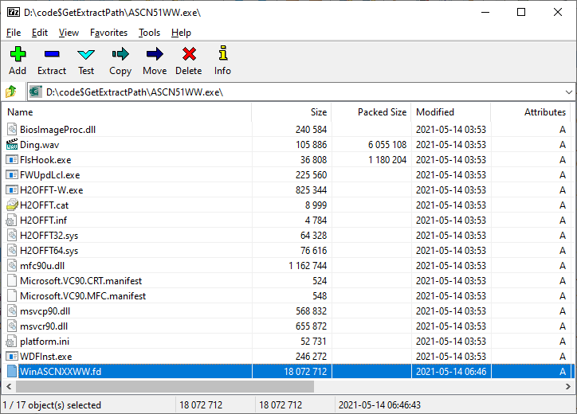
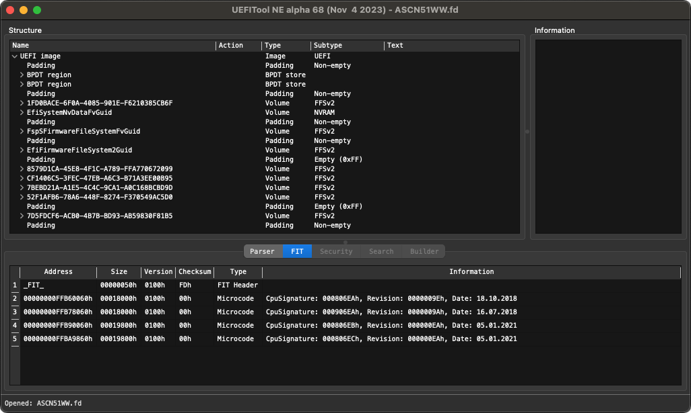
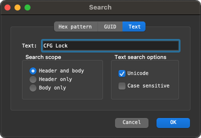
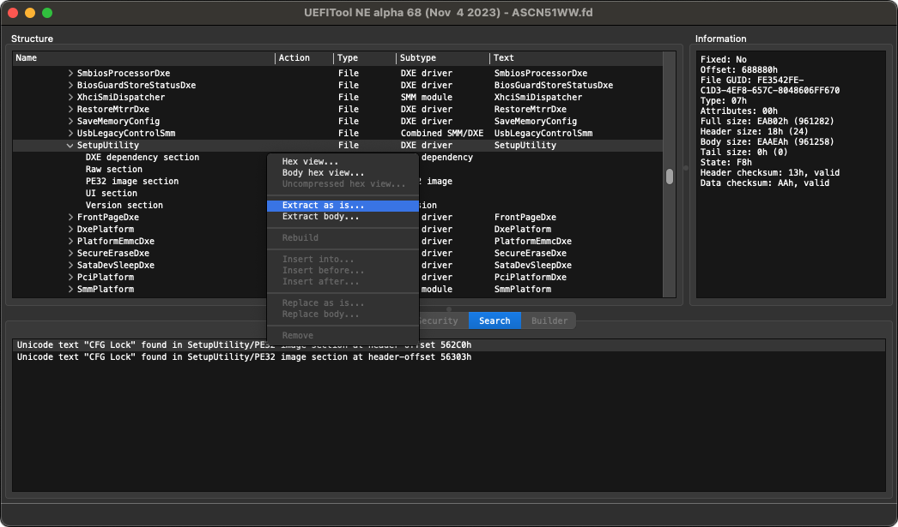

# CFG Lock Detection & Management

## Introduction

According to the [Dortania Guide](https://dortania.github.io/OpenCore-Post-Install/misc/msr-lock.html#what-is-cfg-lock), **CFG Lock** or otherwise known as the "MSR 0xE2" register, is a setting in BIOS that allows for this specific MSR (Model Specific Register) register to be written to. By default, most motherboards **lock** this variable (i.e. read, not write) with many even _hiding_ the option from the BIOS user interface. The reason we care about it, is that macOS actually wants to **write** to this register, and not just one part of macOS: both the Kernel (XNU) and `AppleIntelPowerManagement` want to access it, as it used for the CPU's power management, essential for macOS. Without the ability to write to MSR 0xE2, all or most of the CPU power management is lost and the system may not even boot (unless the correct Quirk is enabled).

Some time ago, I had tried to unlock the "MSR 0xE2" register via the simple, nice UEFI tool by InsanelyMac user **Brumbaer** called [CFGLock.efi](https://www.insanelymac.com/forum/topic/344035-cfglock-unlock-msr-0xe2/) that was run on the UEFI Shell, but for some reason it could not work. Later, when OpenCore developers introduced their own tool called `ControlMsrE2.efi` (that is now part of the OpenCore releases) I tried again to unlock it, but that did not work either; neither tool could produce the needed result.

After understanding how to extract and open a firmware file for analysis, the `setup_var` tool was my last hope to find a solution **before considering the fact that Lenovo locked this variable in the BIOS for good,** by performing the steps described below.

**N.B.** Adequate knowledge and skills using **Terminal.app** are required. Please know that the purpose of this guide is to document the steps needed, not teach how to use the tools.

## Required Tools

* Download [innoextract](https://github.com/dscharrer/innoextract/releases/) for Windows, e.g. `innoextract-1.9-windows.zip`
* Download [7-Zip](https://www.7-zip.org/download.html) installer for Windows, e.g. `7z2301-x64.exe`
* Download [UEFITool](https://github.com/LongSoft/UEFITool/releases/) for Mac, e.g. `UEFITool_NE_A68_universal_mac.zip`
* Download [Universal IFR Extractor](https://github.com/LongSoft/Universal-IFR-Extractor/releases/) for Mac, e.g. `ifrextract_v0.3.7.mac.zip`
* Download [setup_var](https://github.com/datasone/setup_var.efi/releases/) UEFI tool, e.g. latest `setup_var.efi`
* Download latest Lenovo BIOS zip (see in [BIOS](../BIOS/) folder)

**N.B.** The latest build of `ifextract` is v0.3.7 released on December 15, 2020 which works on Apple Intel (x64) systems but it has been discontinued by the developer. Moreover, the latest build of `innoextract` is v1.9 released on August 9, 2020 which works only on Windows, and seems its development has also stopped since. Both tools are command-line only (CLI).

## First steps

Lenovo are packaging their BIOS update files in some Windows executable form, that requires extraction in two steps before being able to access the _actual_ firmware image. This requires the use of a Windows computer to extract the firmware and then a Mac computer can be used for the remaining steps.

In a temporary directory on your Windows PC, download the Lenovo BIOS (.exe) and the **innoextract** tool, and via a Command Prompt window (CMD) run:

```
D:\>innoextract -em ASCN51WW.exe

Extracting "Lenovo BIOS Update Utility" - setup data version 5.5.7 (unicode)
 - "code$GetExtractPath\ASCN51WW.exe" - overwritten
 - "code$GetExtractPath\ASCN51WW.exe"
Done.
```

Next, find the folder that is mentioned in the tool's output e.g. `code$GetExtractPath` where you will see the **extracted** installation file with the same name, in our case it will be `ASCN51WW.exe` again. This version of the file is _usually_ a little smaller than the original downloaded file, and can be opened with **7-Zip File Manager** via right-click menu:



Here you see that the main firmware file has a size about ~18MB and is named `WinASCNXXWW.fd` with the expected extension, namely `.fd`. Click on this file once, and select to extract it on the temporary folder, then via Windows Explorer rename it to the version downloaded, i.e. `ASCN51WW.fd` and copy it across to your Mac computer.

With all the needed tools downloaded on Mac, too, install `UEFITool.app` to your local Applications folder and have the `ifrextract` binary copied in the `/usr/local/bin/` directory, for example. You are now ready to analyse the firmware image.

## Examine Lenovo firmware via UEFITool

Launch **UEFITool** and open your BIOS image file, for example `ASCN51WW.fd`. You will be presented with a screen like this:



Next, press Cmd+F and search for the Unicode text `CFG Lock` in the respective dialog box. If no results appear, it could mean that the firmware no longer supports the `CFG Lock` feature.



In the "Search" results section at the bottom, there should be at least one entry (line) so double-click on the first available result. You will be taken to the respective firmware section that contains our searched text:



Click on the parent container, in our case it wil be `SetupUtility`. Now, right-click over it to select the menu option "Extract as is..." and select a destination folder of your choice, where we will be working next. The automatically generated file name would be `File_DXE_driver_SetupUtility.ffs` but you can simply save it as `SetupUtility.bin` for example.

## Converting the extracted structure

Open a **Terminal.app** session and go to the directory where you saved `SetupUtility.bin` for example, and convert this structure file to human-readable plain text:

```
% /usr/local/bin/ifrextract SetupUtility.bin SetupUtility.txt

Input: SetupUtility.bin
Output: SetupUtility.txt
Protocol: UEFI
```

Now, with some text editor or viewer (e.g. BBEdit) open the resulting `SetupUtility.txt` and search for the term `CFG Lock` again. The result should be something like this:

```
0xABE20	Form: View/Configure CPU Lock Options, FormId: 0x1012 {01 86 12 10 64 01}
0xABE26		One Of: CFG Lock, VarStoreInfo (VarOffset/VarName): 0x3E, VarStore: 0x03, QuestionId: 0x16D, Size: 1, Min: 0x0, Max 0x1, Step: 0x0 {05 91 5C 03 5D 03 6D 01 03 00 3E 00 10 10 00 01 00}
0xABE37			One Of Option: Disabled, Value (8 bit): 0x0 {09 07 04 00 00 00 00}
0xABE3E			One Of Option: Enabled, Value (8 bit): 0x1 (default) {09 07 03 00 30 00 01}
0xABE45		End One Of {29 02}
0xABE47		One Of: Overclocking Lock, VarStoreInfo (VarOffset/VarName): 0xDA, VarStore: 0x03, QuestionId: 0x16E, Size: 1, Min: 0x0, Max 0x1, Step: 0x0 {05 91 58 03 59 03 6E 01 03 00 DA 00 10 10 00 01 00}
0xABE58			One Of Option: Disabled, Value (8 bit): 0x0 (default) {09 07 04 00 30 00 00}
0xABE5F			One Of Option: Enabled, Value (8 bit): 0x1 {09 07 03 00 00 00 01}
0xABE66		End One Of {29 02}
0xABE68	End Form {29 02}
```

Normally, you would find only one occurrence of `CFG Lock` entry in this text file.

Now, study carefully the line:

`CFG Lock, VarStoreInfo (VarOffset/VarName): 0x3E, VarStore: 0x03, QuestionId: 0x16D, Size: 1 [...]`

This tells us that the `CFG Lock` variable is found/stored in `VarStore: 0x03` at the `VarOffset: 0x3E` and has size of `0x01` byte. Now, we move all the way up of the `SetupUtility.txt` file, where there normally is a reference list of all available VarStore folders in the firmware. We search for `0x03` and we should find:

`0xA5C6A  VarStore: VarStoreId: 0x03 [B08F97FF-E6E8-4193-A997-5E9E9B0ADB32], Size: 0x23A, Name: CpuSetup {24 1F [...]`

Here we read that the name of `VarStore: 0x03` is called `CpuSetup`.

Therefore, our CFG Lock variable is found in `VarStore: 0x03` named `CpuSetup` at `VarOffset: 0x3E` with size of `0x01` byte.

:warning: Variable offsets are unique not just to each motherboard but **even to its firmware version.** Never try to use an offset without checking!

## Booting in UEFI to change the value

We will now need to mount our EFI partition and copy the UEFI tool `setup_var.efi` in our **Tools** folder of our bootloader e.g. in `/EFI/OC/Tools/` and after ejecting the EFI partition, we reboot the computer. On the OpenCore Picker screen, we choose the *UEFI Shell* icon (meaning **OpenShell.efi** must be registered and enabled in your `config.plist`).

In the shell screen, we should find our boot EFI partition by entering the drive such as `FS0:`, `FS1:` or even `FS2:` depending on the system setup and boot disk partition(s) of the laptop. A good practice is to type the drive name and then `dir` the contents, to be sure we are in the correct EFI partition.

Once we change to the Tools directory via `cd`, we can find our `setup_var.efi` tool and we can now attempt to disable the **CFG Lock** feature by setting a value of `0x00` i.e. zero. If we check the help text of the `setup_var.efi` tool via `-h` or `--help` we will see the syntax needed:

```
Usage: setup_var.efi <OFFSET> [<VALUE>] [-s <VALUE_SIZE>] [-n <VAR_NAME>] [-i <VAR_ID>] [-r/--reboot] [--write_on_demand]

OFFSET: The offset of value to be altered in the UEFI variable.
	VALUE: The new value to write, capped at 64-bit. If not specified, the value at OFFSET will be read and shown.
	VALUE_SIZE: Bytes of value to write, must be equal or larger than the size of <VALUE>, defaults to 0x1.
	VAR_NAME: The name of UEFI variable to be altered, defaults to "Setup".
	VAR_ID: Unique id for distinguishing variables with same name, which will be provided by setup_var.efi (when required).
	-r or --reboot: Reboot (warm reset) the computer after the program successfully finishes.
	--write_on_demand: If the value desired to be written is the same with storage, skip the unnecessary write.

	OFFSET, VALUE, VALUE_SIZE and VAR_ID are numbers, and must be specified in hexadecimal with prefix "0x".

	The program defaults to little endian for values ONLY while operating UEFI variables,
	though it's recommended to only operate on one byte if you are not sure what this is or means.
```

Our resulting command to enter in the UEFI Shell and with the information extracted from the previous section and effort, is therefore:

`.\setup_var.efi 0x3E 0x00 -s 0x01 -n CpuSetup -r`

## Outcome

I was very surprised to briefly see a confirmation `Written value in bytes: 0x00` before the computer rebooted due to the `-r` parameter, only to confirm with OpenCore's `VerifyMsrE2.efi` tool that the "MSR 0xE2" register now is UNLOCKED. After rebooting once more from OpenCore Picker screen, I selected to **clean NVRAM** via OpenCore's integrated option and let macOS boot normally.

**N.B.** The tool `VerifyMsrE2.efi` is no longer being provided in OpenCore releases, as the OpenCore team stopped including it since version 0.6.8 of the bootloader. However, I still include it in my EFI Tools folder, as it is a read-only tool that is quick and handy and allows for confirmation of the MSR register's status without messing with UEFI Shell. It has been replaced by `ControlMsrE2.efi` which requires a few parameters for the same functionality.

## Conclusion

I am not in a position to judge if things have improved since unlocking the "MSR 0xE2" register, but it seems that the Kernel Quirk `AppleXcpmCfgLock` (due to the CPU generation, see the OpenCore [Configuration PDF](https://github.com/acidanthera/OpenCorePkg/blob/master/Docs/Configuration.pdf) for more information) in OpenCore configuration can now be set to FALSE. Nevertheless, the previous complete OpenCore EFI structure should be made available on some USB flash-disk in case booting cannot be achieved, should the "MSR 0xE2" register becomes read-only again.

:warning: **Resetting BIOS to Defaults, or flashing any newer firmware image (via Lenovo's official BIOS Update Utility for Windows) will most certainly re-lock the "MSR 0xE2" register, so be sure to check its status before booting!**

## Alternatives

There is an alternative tool called [RU](https://github.com/JamesAmiTw/ru-uefi/) alongside a nice guide created by user [Dreamwhite](https://github.com/dreamwhite/bios-extraction-guide/blob/master/ru.efi.md) which offers a visual interface when navigating in the local saved BIOS sections and parameters, with the ability to change them on-the-fly. However, I will _not_ attempt anything further as I am not experienced with this tool and the simple use of the `setup_var.efi` does the job equally well.
