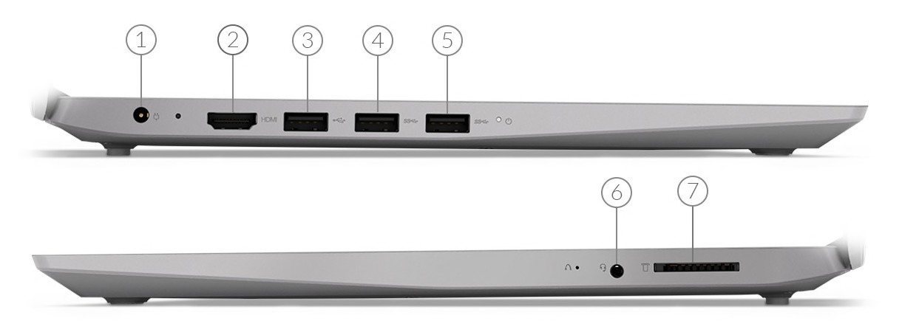
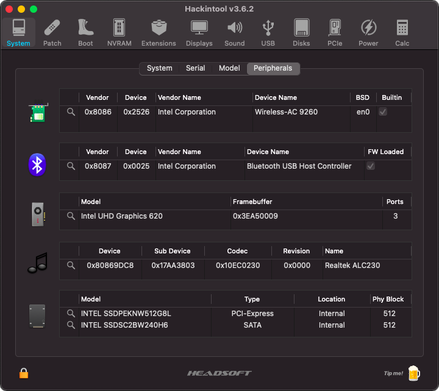
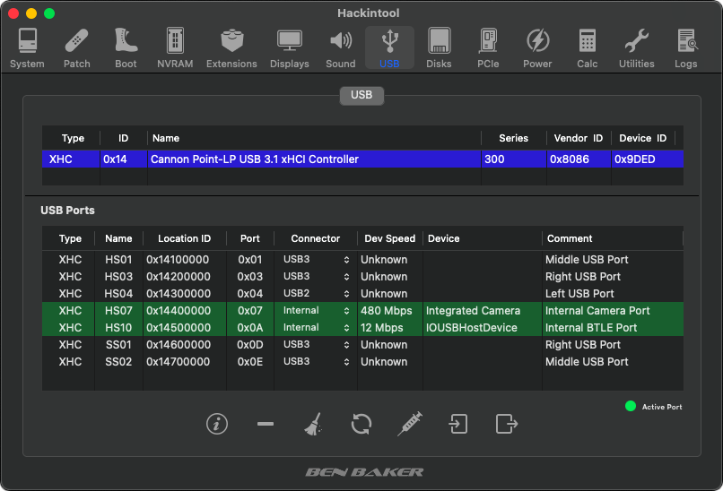
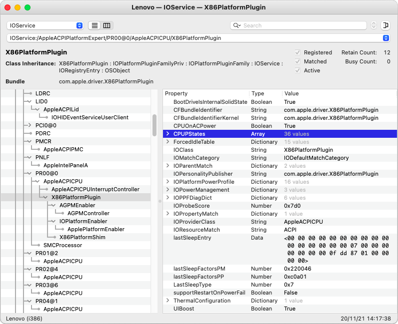
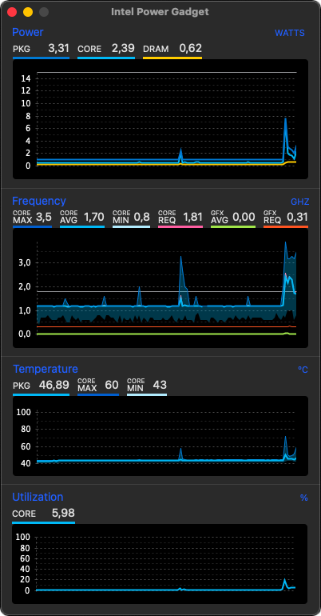
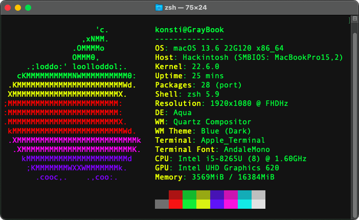
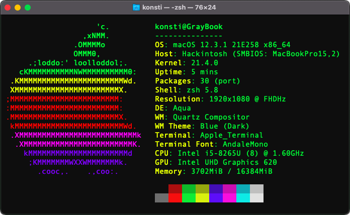
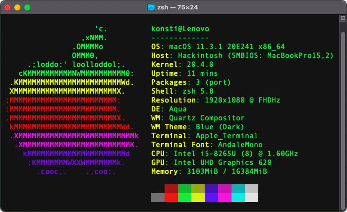

# Lenovo IdeaPad S145-14iWL

${\textsf{\color{red}As of June 2024, the project is abandoned after repurposing this laptop for other use.}}$

${\textsf{\color{red}Last working status: 0.9.8 configuration via OpenCore 1.0.0 for macOS 13.6.7 Ventura.}}$

This repository contains personal work and files, developed and maintained for a successful use with [Clover EFI bootloader](https://github.com/CloverHackyColor/CloverBootloader/) originally and [OpenCore bootloader](https://github.com/acidanthera/OpenCorePkg) subsequently, on this specific Lenovo model. There are no ready, pre-packaged EFI solutions provided; instead, the needed configuration and ACPI files are published for those interested in studying the code, while creating their own bootloader configurations.

## Platform Generation

* Sandy Bridge = All Core ix-3xxx (HD Graphics 3000)
* Ivy Bridge = All Core ix-3xxx (HD Graphics 4000)
* Haswell = All Core ix-4xxx (HD Graphics 4600)
* Broadwell = All Core ix-5xxx (Iris Pro Graphics 6200)
* Skylake = All Core ix-6xxx (HD Graphics 5xx)
* Kaby Lake = All Core ix-7xxx (UHD/Iris Plus Graphics 6xx)
* Coffee Lake = All Core ix-8xxx (UHD/Iris Plus Graphics 6xx)
* **Whiskey Lake = All Core ix-8xxx (UHD Graphics 6xx)**

## Product Information: IdeaPad Series (2019)

**Specifications:** see [Lenovo website](https://psref.lenovo.com/Detail/IdeaPad/ideapad_S14514IWL?M=81MU0053FR)

**Platform:** see [Lenovo IdeaPad S145 14iWL Platform.pdf](Components/Lenovo%20IdeaPad%20S145-14iWL%20Platform.pdf)

**Downloads:** see [Lenovo website](https://pcsupport.lenovo.com/products/laptops-and-netbooks/ideapad-s-series-netbooks/s145-14iwl/downloads/driver-list/)

## Processor Generation: Whiskey Lake (2018)

**CPU:** Intel Core i5-8265U @ 1.60 GHz up to 3.90 GHz / 4 Cores / 8 Threads

**GPU:** Intel UHD Graphics 620 @ 300 MHz up to 1.10 GHz

**Specifications:** see [Intel website](https://www.intel.com/content/www/us/en/ark/products/149088/intel-core-i58265u-processor-6m-cache-up-to-3-90-ghz.html)

## Geekbench

**V4 Scores:** https://browser.geekbench.com/v4/cpu/search?q=Core+i5-8265U

**V5 Scores:** https://browser.geekbench.com/v5/cpu/search?q=Core+i5-8265U

## Product Overview

| Port(s) | Features              |
| ------- | ----------------------|
| Port 1  | 20V DC Power Input    |
| Port 2  | HDMI 1.4b Port        |
| Port 3  | USB 2.0 Port          |
| Port 4  | USB 3.0 Port          |
| Port 5  | USB 3.0 Port          |
| Port 6  | 3.5mm Headphone Input |
| Port 7  | 4-in-1 Card Reader    |

## Compatible Models

Mac Model: **MacBookPro15,2** 
CPU: Intel Core i5-8259U @ 2.30 GHz 
GPU: Intel Iris Plus Graphics 655 
Everymac: https://everymac.com/ultimate-mac-lookup/?search_keywords=MacBookPro15,2 
Board ID: Mac-827FB448E656EC26 
BIOS Revision: MBP152.88Z.F000.B00.2001180025 
BIOS Revision: MBP152.88Z.F000.B00.2004232118 
BIOS Revision: MBP152.88Z.F000.B00.2103102019 
BIOS Revision: MBP152.88Z.F000.B00.2105212330 
BIOS Revision: MBP152.88Z.F000.B00.2110032010 
BIOS Revision: MBP152.88Z.F000.B00.2202152135 

## Current Setup

**Memory:** 16GB in 1 x 16GB SO-DIMM (1.2V) 
**RAM:** Kingston HyperX **Impact** DDR4 @ 2666 MHz CL15 (Model HX426S15IB2/16) 
**WLAN:** Intel Wireless-AC 9260 Adapter (NGFF) [[8086:2526]](https://pci-ids.ucw.cz/read/PC/8086/2526) 
**BTLE:** Intel BTLE 5.1 Integrated Device [8087:0025] 
**NVMe:** Intel NVMe 660p Series (M.2) 512GB (Model SSDPEKNW512G8L) [[8086:f1a8]](https://pci-ids.ucw.cz/read/PC/8086/f1a8) 
**SSD:** Intel SSD 535 Series 240GB (Model SSDSC2BW240H6) 

**N.B.** The original 8GB RAM module was **SKhynix** DDR4 @ 2666 MHz PC4-21300 (Model HMA81GS6CJR8N-VK)

## Required BIOS Settings

For the essential but _required_ BIOS settings, as well as previous firmware releases, see [BIOS](BIOS/) folder.

## Migrating to OpenCore

The migration from Clover to OpenCore bootloader was possible by [converting common properties using the OpenCore Install Guide](https://dortania.github.io/OpenCore-Install-Guide/clover-conversion/Clover-config.html) and then fine-tuning by comparing some parameters that worked with the [Coffee Lake and Whiskey Lake Guide](https://dortania.github.io/OpenCore-Install-Guide/config-laptop.plist/coffee-lake.html) for laptops.

## OpenCore Picker Keyboard Shortcuts

When the `Timeout` key is set and OpenCore Picker displays the available boot drives:

* Press **Space Bar** to access the hidden _Auxiliary_ tools e.g. UEFI Shell, NVRAM Cleanup, Verify MSR Lock.
* Press **Tab** to move selection to the newly available Reboot and Shutdown icons (since OpenCore 0.6.8).

Alternatively, if `ShowPicker` is disabled or `Timeout` set to 0, keep pressing **Escape** or **Zero** or **Option** keys to access Picker just before OpenCore kicks-in and starts booting.

## Active Configuration

* No CPU ID faking required, power management is native; MSR `0xE2` remains locked; :warning:
* All external USB 2.0 and 3.0 ports work as expected; using generated `USBPorts.kext`;
* Intel graphics acceleration works as platform ID `0x3EA50009` with [WhateverGreen](https://github.com/acidanthera/WhateverGreen/releases);
* HDMI connection works only with **hot-plugging** and _after_ using special IGPU port patching;
* Analogue audio output from speakers works as layout ID `0x14` with [AppleALC](https://github.com/acidanthera/AppleALC/releases/);
* Digital audio output is detected and can be selected when HDMI connection is active;
* The replaced Intel Wireless-AC module works with [OpenIntelWireless](https://github.com/OpenIntelWireless/itlwm/releases);
* The BTLE module embedded in Intel Wireless-AC works with [IntelBluetoothFirmware](https://github.com/OpenIntelWireless/IntelBluetoothFirmware/releases);
* The Integrated 4-in-1 Card Reader is not compatible; cannot be disabled in BIOS;
* Power Management is present and active as `X86PlatformPlugin` is attached to `PR00` in IORegistry;
* Sleep/Wake both work without issues; see "Power" section in [Hackintool](https://github.com/headkaze/Hackintool/releases);
* Both NVMe and SSD SATA interfaces work with no effort nor kext needed.

For the complete list of all detected PCI hardware components and their respective addresses via `lspci -nn` command (in Ubuntu, loaded via USB) see [here](Various/lspci-nn.txt). This list was created with all devices enabled in BIOS and is used as a device "map" so that PCI IDs can be detected before tweaking the hardware (and BIOS) to run macOS.

## Intel UHD Graphics 620 Properties

The `AAPL,ig-platform-id` property set to `0x3EA50009` together with needed `device-id` set to `0x3EA50000` are used for **WhateverGreen** to successfully enable acceleration on this graphics device [[8086:3ea0]](http://pci-ids.ucw.cz/read/PC/8086/3ea0). This ID represents the following properties and connectors:

| Properties             | Value(s)                                  |
| ---------------------- | ----------------------------------------- |
| Platform ID            | `0x3EA50009` i.e. `0900A53E` → `CQClPg==` |
| Device ID              | `0x3EA50000` i.e. `A53E0000` → `pT4AAA==` |
| Mobile                 | Yes                                       |
| Stolen Memory          | 57 MB                                     |
| Framebuffer Memory     | 0 MB                                      |
| Video Memory (VRAM)    | 1536 MB                                   |
| Total Stolen Memory    | 58 MB                                     |
| Total Cursor Memory    | 1 MB                                      |
| Maximum Stolen Memory  | 172 MB                                    |
| Maximum Overall Memory | 173 MB                                    |
| Model Name             | Intel HD Graphics CFL CRB                 |
| Camellia               | CamelliaV3 (3)                            |
| Port / Pipe Count      | 3 / 3                                     |
| Default Port Index #0  | Bus ID `0x00` Pipe `8`  Connector LVDS    |
| Default Port Index #1  | Bus ID `0x05` Pipe `9`  Connector DP      |
| Default Port Index #2  | Bus ID `0x04` Pipe `10` Connector DP      |
| Patching Required      | Yes                                       |

:warning: **Important Note:** This Intel UHD Graphics 620 controller defaults to 32MB video memory and there exists **no BIOS setting** to change it; patching is thus needed for DVMT (Dynamic Video Memory Technology) pre-allocation to set over 32MB of video memory in order to avoid several graphics issues and/or kernel panics. According to the Dortania [Coffee Lake and Whiskey Lake Guide](https://dortania.github.io/OpenCore-Install-Guide/config-laptop.plist/coffee-lake.html#deviceproperties) for laptops, the following device properties must be set for WhateverGreen:

| Key                      | Type | Value                   |
| ------------------------ | ---- | ----------------------- |
| framebuffer-patch-enable | Data | `01000000` → `AQAAAA==` |
| framebuffer-fbmem        | Data | `00009000` → `AACQAA==` |
| framebuffer-stolenmem    | Data | `00003001` → `AAAwAQ==` |

:no_entry_sign: **Warning:** Other users' configurations or guides found on-line, proposed the use of alternative set of values for this GPU which proved rather _unstable_ with this specific laptop setup:

| Properties  | Alternative Value(s)                      |
| ----------- | ----------------------------------------- |
| Platform ID | `0x3E9B0000` i.e. `00009B3E` → `AACbPg==` |
| Device ID   | `0x3E9B0000` i.e. `9B3E0000` → `mz4AAA==` |

## USB Port Mapping

| USB 2.0 Port Name | USB 3.0 Port Name | Hardware Location    | Controller     |
| ----------------- | ----------------- | -------------------- | -------------- |
| HS04              | N/A               | Left socket          | XHCI           |
| HS01              | SS02              | Middle socket        | XHCI           |
| HS03              | SS01              | Right socket         | XHCI           |
| HS07              | N/A               | Internal Camera port | XHCI           |
| HS10              | N/A               | Internal BTLE port   | XHCI           |

The above active and working USB ports are listed in Hackintool when **all unused or non-referenced USB ports** are removed. In any other situation, ports such as HS02, HS05, HS06, HS08, HS09, USR1, USR2, SS03 and SS04 may be listed. All ports above are defined in `USBPorts.kext` according to their _electrical_ connector.

## WLAN Hardware Replacement

The factory-installed Realtek RTL8821CE wireless card (NGFF) was originally replaced with the **Broadcom BCM4350** wireless card [[14e4:43a3]](https://pci-ids.ucw.cz/read/PC/14e4/43a3) what worked well in macOS Catalina with [AirportBrcmFixup](https://github.com/acidanthera/AirportBrcmFixup/releases) including its BCM2045A0 Bluetooth device [0a5c:6414] that is supported by [BrcmPatchRAM](https://github.com/acidanthera/BrcmPatchRAM/releases). For reference, this card also known as [DW1820A](http://en.techinfodepot.shoutwiki.com/wiki/Dell_Wireless_1820A_(DW1820A)) is produced by Foxconn under the code **T77H649.00** and uses a BCM94350ZAE chipset, carrying a Lenovo FRU reference **00JT494** [17aa:075a].

However, according to this [OSXLatitude thread](https://osxlatitude.com/forums/topic/11322-broadcom-bcm4350-cards-under-high-sierramojavecatalinabig-surmonterey/) "Big Sur dropped support for Broadcom BCM4331 and BCM43324 which results in `AirPortBrcm4360.kext` being no more". A workaround is offered, but eventually this NGFF card was only causing headaches and was replaced with this **Intel Wireless-AC 9260** adapter card.

## Wireless Connectivity

The original 802.11ac PCIe wireless card [[10ec:c821]](https://pci-ids.ucw.cz/read/PC/10ec/c821) comes from Realtek (model RTL8821CE with integrated Bluetooth controller) but is *not* compatible with macOS, as there is no driver support. 

It was finally replaced with an Intel **Wireless-AC 9260** adapter [[8086:2526]](https://pci-ids.ucw.cz/read/PC/8086/2526) that also includes an integrated Bluetooth 5.1 adapter [8087:0025] working well with the [OpenIntelWireless](https://github.com/OpenIntelWireless/itlwm/releases) driver, as the **Broadcom BCM4350** purchased caused only headaches especially on Big Sur, despite being supported by [AirportBrcmFixup](https://github.com/acidanthera/AirportBrcmFixup/releases).

## CPU Power Management

With the injection of `SSDT-PLUG.aml` via OpenCore, we can verify that Power Management is present and active as `X86PlatformPlugin` is attached to the first CPU core `PR00` per the [Dortania Guide](https://dortania.github.io/OpenCore-Post-Install/universal/pm.html).

## Changes Brought About by macOS 12 and macOS 13

MacOS 12.x _Monterey_ has brought an important change in OpenCore configuration for BTLE, namely the required removal of **IntelBluetoothInjector.kext** and its replacement by **BlueToolFixup.kext** found inside [BrcmPatchRAM](https://github.com/acidanthera/BrcmPatchRAM) package. The main **IntelBluetoothFirmware.kext** remains active and must still be loaded, as done previously.

:warning: From version 2.2.0 of [IntelBluetoothFirmware](https://github.com/OpenIntelWireless/IntelBluetoothFirmware/releases) onwards, there is a new kext **IntelBTPatcher.kext** included that the developers recommend loading as it fixes a bug in Apple's _Monterey_ re-written Bluetooth stack. For more details read [here](https://openintelwireless.github.io/IntelBluetoothFirmware/FAQ.html#what-is-intelbtpatcher-trying-to-fix).

There is also a distinct version of [AirportItlwm.kext](https://github.com/OpenIntelWireless/itlwm/releases) compiled for _Monterey_ only that has to be installed, replacing the Big Sur version of the kext _without_ any OpenCore configuration changes, however.

## Changes Brought About by macOS 11

An analysis of all the novelties that _Big Sur_ brings are detailed over at [Dortania](https://dortania.github.io/hackintosh/updates/2020/11/12/bigsur-new.html).

## Using VMware Fusion 12 and Windows 10 on SATA drive

Once macOS is successfully installed on the NVMe drive, we can use [VMware Fusion 12](https://www.vmware.com/go/getfusion) to install Windows 10 on the SATA drive, thus avoiding the need for dual-boot that does _not_ seem to work too well, all the time. Detailed instructions on how to use the physical SATA drive with VMware Fusion 12 [can be found here](Fusion.md).
